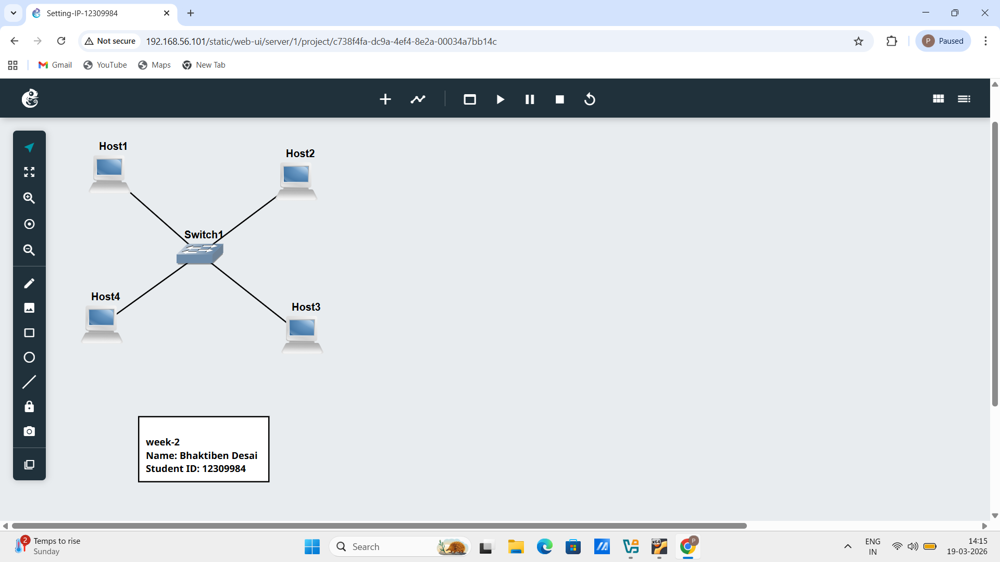
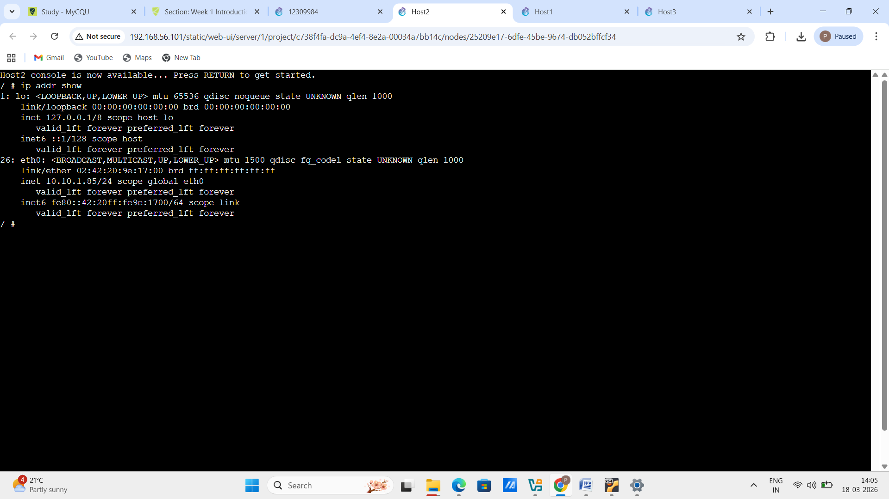
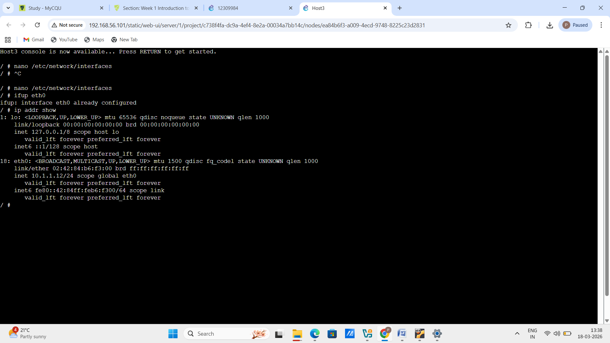
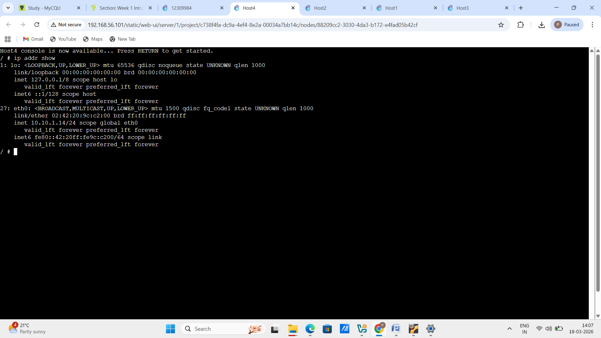

# Exported Project

# Screenshot of the network

# Screenshot of the console of each of the four hosts showing the IP addresses from ip address show

1. Screenshort Of Host1:

2. Screenshort Of Host2:

3. Screenshort Of Host3:

4. Screenshort Of Host4:

