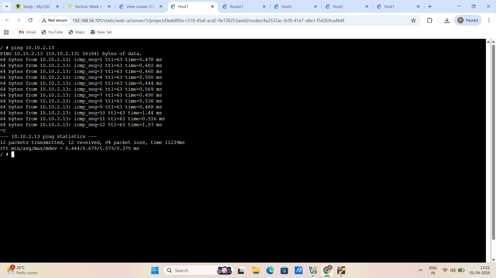
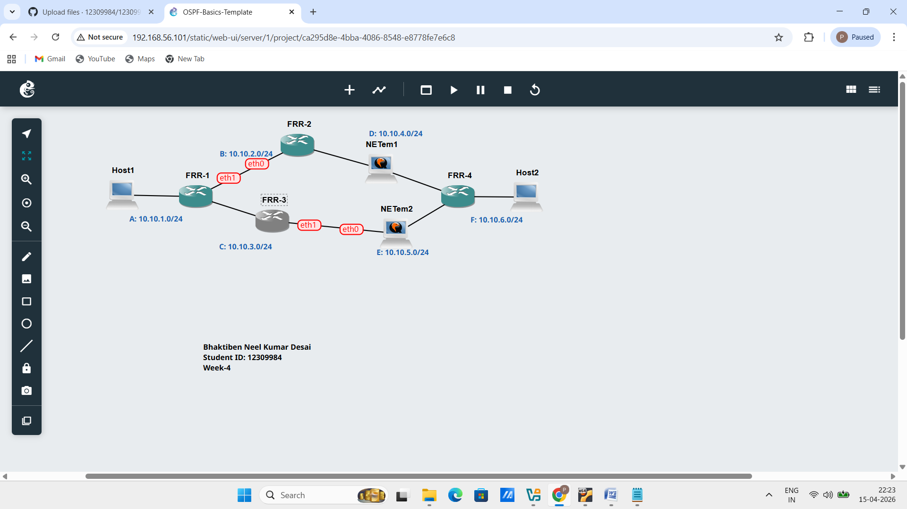
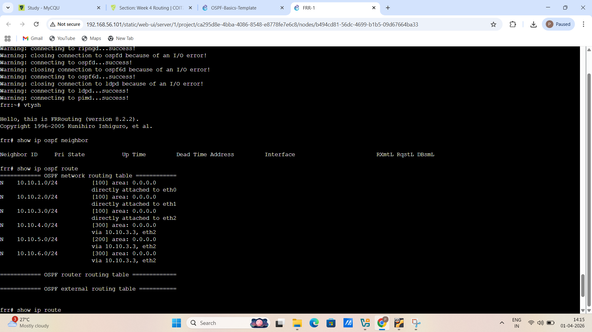
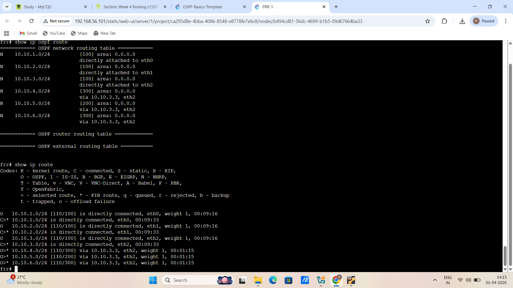
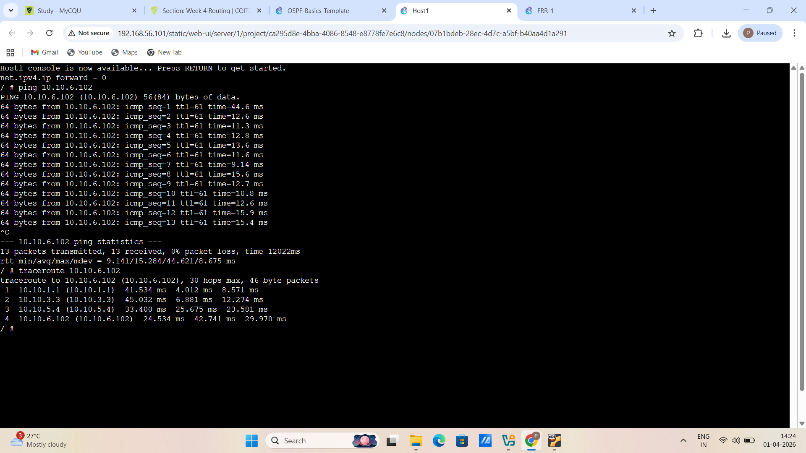

# EXPORTED PROJECT #

# -> Screenshot of the network

# -> Record of the IP addresses and routing tables of each host and router

# 1. HOST-1

# 2. HOST-2

# 3. HOST-3

# 4. ROUTER

# -> Screenshot of a successful ping from a host one one subnet to a host on the other subnet

# TASK-2 #

# Exported Project

# -> Screenshot of the network

# -> Output showing neigbour routers of FRR1

# -> Output showing routing table for two routers

# -> Output of traceroute commands before and after the link is disconnected 

