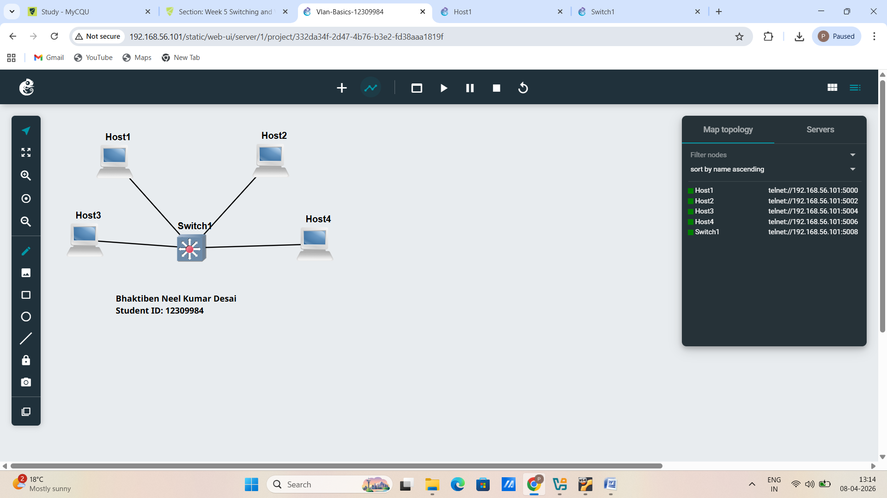
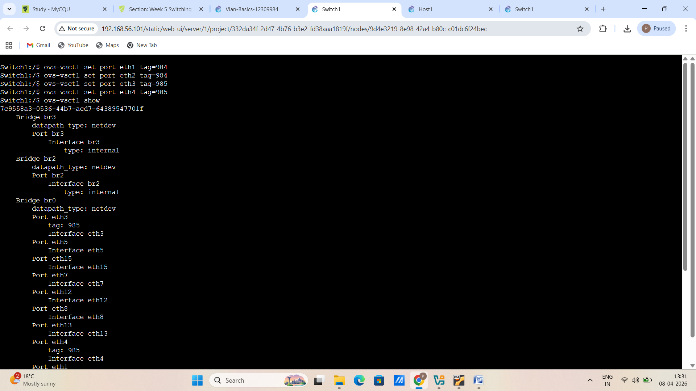
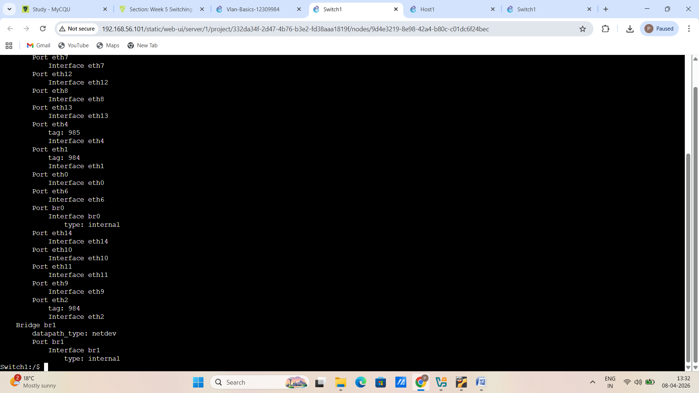
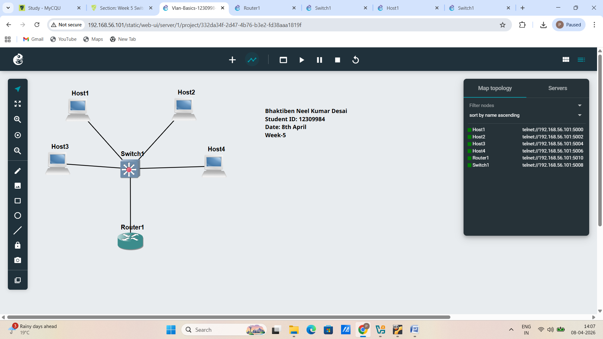
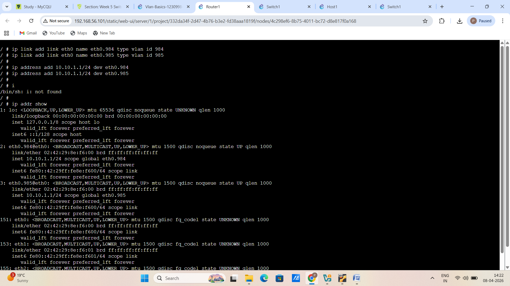

# EXPORTED PROJECT

# -> Screenshot of the network

# -> Screenshot showing the ports and tags on the switch

# TASK-2 #

# EXPORTED PROJECT 

# -> Screenshot of the network 

# -> Screenshot showing the ports and tags on the switch

