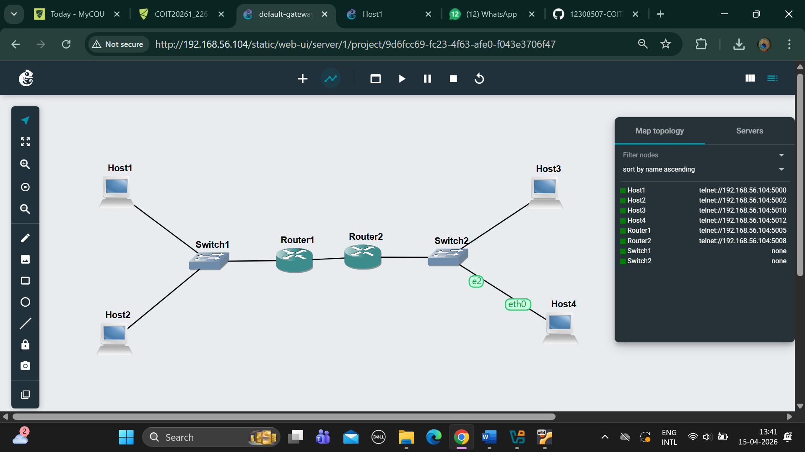
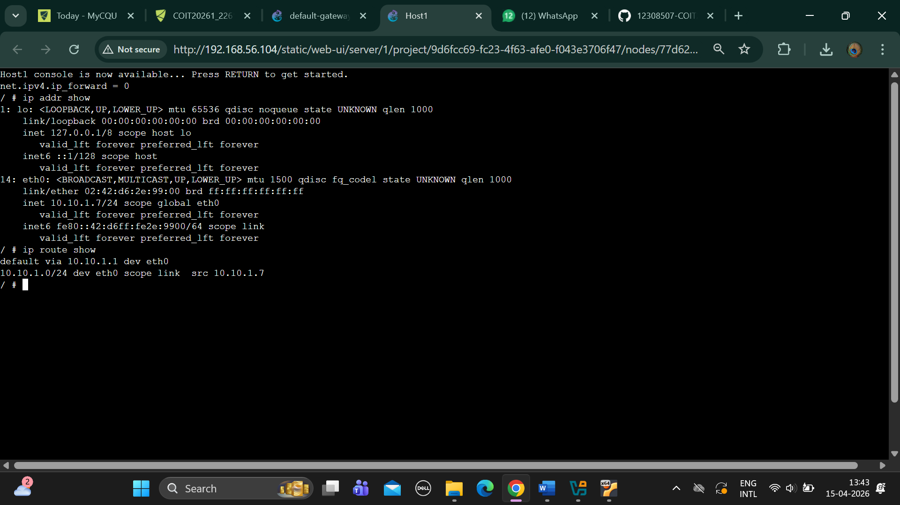
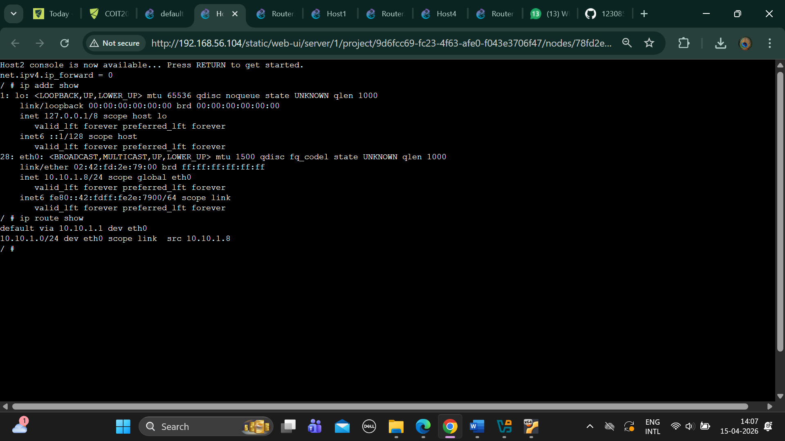
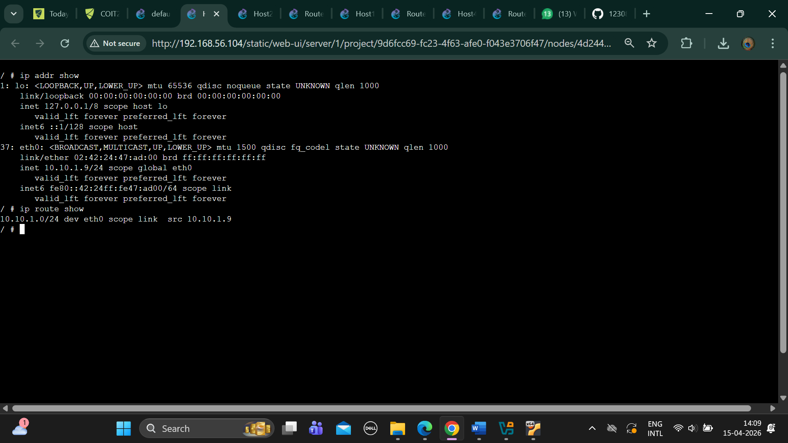
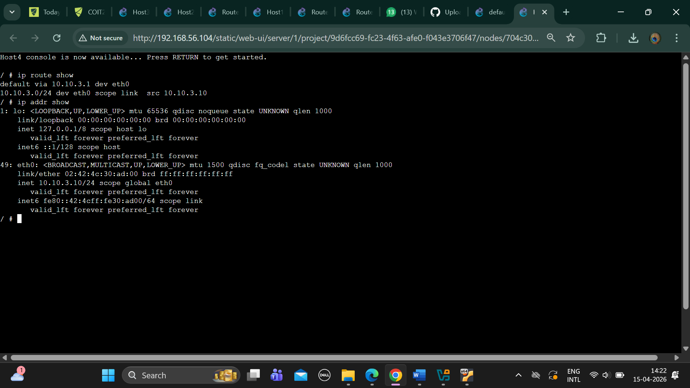
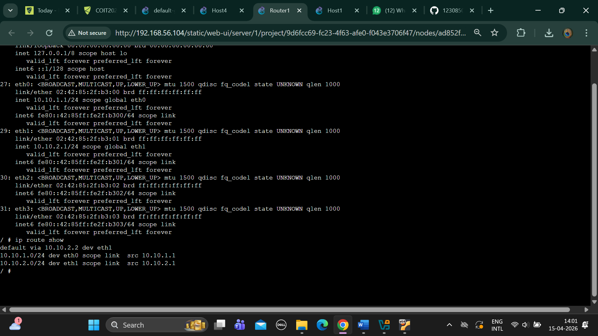
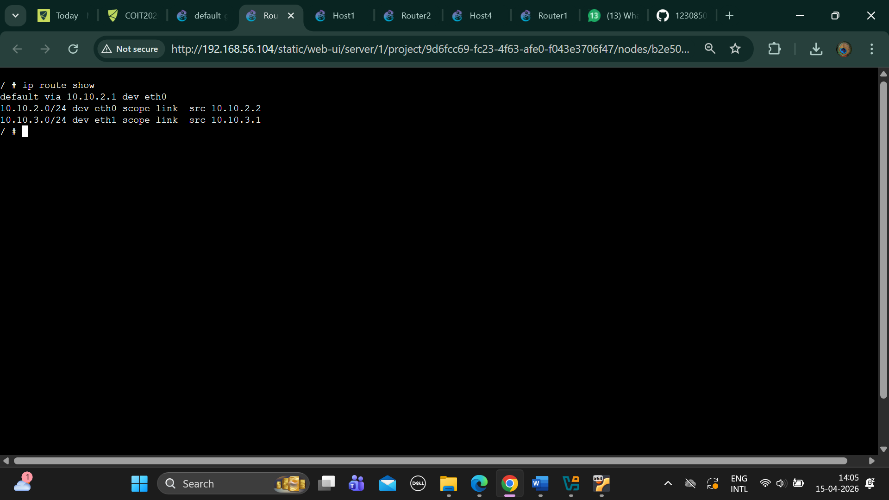
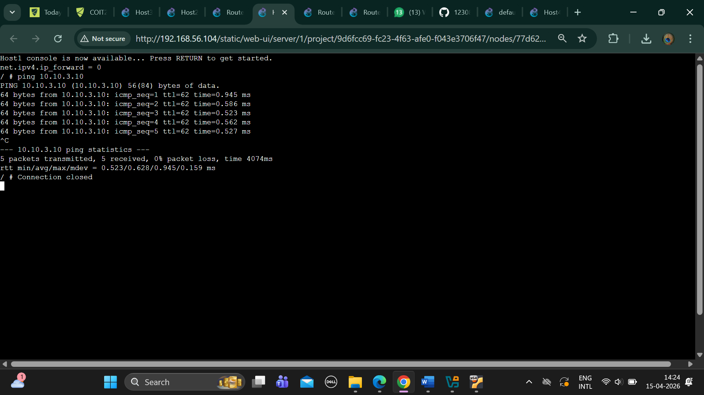

# -> 1.	Screenshots of ARP tables of host A at different time points that illustrate the changes in the ARP table as devices communicate

# TASK-2

# EXEPORTED PROJECT

#	Screenshot of the network

# -> Record of the IP addresses and routing tables of each host and router

# Host1 Routintable 

# Host2 Routintable

# Host3 Routintable

# Host4 Routintable

# Router1 Routintable

# Router2 Routintable

# -> Screenshot of a successful ping from a host one one subnet to a host on the other subnet

