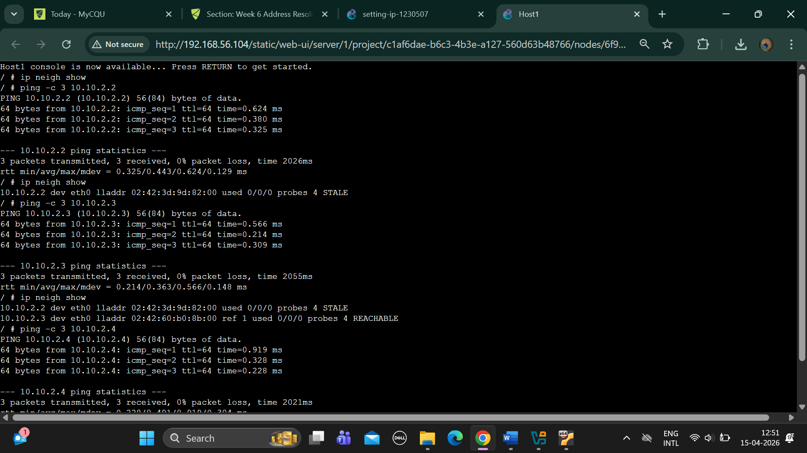
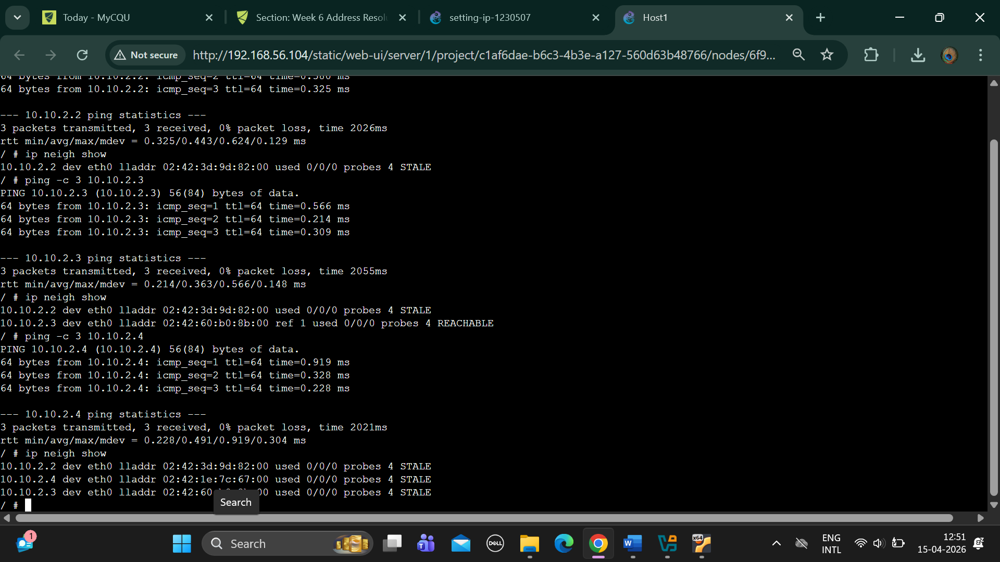

# -> 1.	Screenshots of ARP tables of host A at different time points that illustrate the changes in the ARP table as devices communicate

# TASK-2

# EXEPORTED PROJECT

# -> There are 4 hosts, 2 switches and 2 routers, creating 3 subnets

